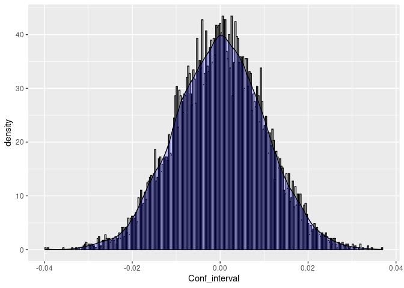

A/B test in R
================

# Hotel Booking A/B testing

Let’s consider a scenario where we have A/B test results from two
distinct hotel booking websites. Our first course of action is to
perform a thorough analysis of the data. Once we have completed the
initial analysis, we can then extract meaningful insights from the data
and use them to draw conclusions in the second step. Finally, based on
our conclusions, we can offer actionable recommendations or suggestions
to the relevant product or management teams.

## Data Set Summary

Variant A represents the control group that showcases the current
features or products available on a website. In contrast, Variant B is
from the experimental group that tests a new version of a feature or
product to assess its impact on user engagement or conversions (such as
bookings). To evaluate the effectiveness of each variant, the data set
includes two defined categories based on logical values: “converted” is
registered as “true” when a customer successfully completes a booking,
while “false” indicates a customer who visits the website but does not
complete a booking.

## Test Hypothesis

The null hypothesis states that both versions A and B have an equal
likelihood of driving customer bookings or conversions. In other words,
there is no significant difference or effect between the two versions.
Conversely, the alternative hypothesis suggests that versions A and B
have different probabilities of driving customer bookings, indicating a
difference between the two versions. Version B is better than version A
in driving customer bookings. PExp_B! = Pcont_A.

# Analysis

#### 1.Preparing the dataset and loading libraries

``` r
install.packages("tidyverse") 
```

    ## Installing package into '/cloud/lib/x86_64-pc-linux-gnu-library/4.2'
    ## (as 'lib' is unspecified)

``` r
library(tidyverse)
```

    ## ── Attaching core tidyverse packages ──────────────────────── tidyverse 2.0.0 ──
    ## ✔ dplyr     1.1.0     ✔ readr     2.1.4
    ## ✔ forcats   1.0.0     ✔ stringr   1.5.0
    ## ✔ ggplot2   3.4.1     ✔ tibble    3.2.0
    ## ✔ lubridate 1.9.2     ✔ tidyr     1.3.0
    ## ✔ purrr     1.0.1

    ## ── Conflicts ────────────────────────────────────────── tidyverse_conflicts() ──
    ## ✖ dplyr::filter() masks stats::filter()
    ## ✖ dplyr::lag()    masks stats::lag()
    ## ℹ Use the ]8;;http://conflicted.r-lib.org/conflicted package]8;; to force all conflicts to become errors

``` r
ABTest <- read.csv("Website Results.csv", 
                   header = TRUE)
```

#### 2.Let’s filter conversions for variants A & B and compute their corresponding conversion rates

``` r
# conversions for variant_A
conversion_subset_A <- ABTest %>%
    filter(variant == "A" & converted == "TRUE")

# Total Number of Conversions for variant_A
conversions_A <- nrow(conversion_subset_A)

# Number of Visitors for variant_A
visitors_A <- nrow(ABTest %>%
    filter(variant == "A"))

# Conversion_rate_A
conv_rate_A <- (conversions_A/visitors_A)
print(conv_rate_A)
```

    ## [1] 0.02773925

``` r
# Subset of conversions for variant_B
conversion_subset_B <- ABTest %>%
    filter(variant == "B" & converted == "TRUE")

# Number of Conversions for variant_B
conversions_B <- nrow(conversion_subset_B)

# Number of Visitors for variant_B
visitors_B <- nrow(ABTest %>%
    filter(variant == "B"))

# Conversion_rate_B
conv_rate_B <- (conversions_B/visitors_B)
print(conv_rate_B) 
```

    ## [1] 0.05068493

#### 3.Let’s compute the relative uplift using conversion rates A & B. The uplift is a percentage of the increase

``` r
uplift <- (conv_rate_B - conv_rate_A) / conv_rate_A * 100
uplift # 82.72%
```

    ## [1] 82.71918

B is better than A by 83%. This is high enough to decide a winner.

#### 4.Let’s compute the pooled probability, standard error, the margin of error, and difference in proportion (point estimate) for variants A & B

``` r
# Pooled sample proportion for variants A & B
p_pool <- (conversions_A + conversions_B) / (visitors_A +
                                            visitors_B)
print(p_pool) 
```

    ## [1] 0.03928325

``` r
# Let's compute Standard error for variants A & B (SE_pool)
SE_pool <- sqrt(p_pool * (1 - p_pool) * ((1 / visitors_A) +
                                        (1 / visitors_B)))
print(SE_pool) 
```

    ## [1] 0.01020014

``` r
# Let's compute the margin of error for the pool
MOE <- SE_pool * qnorm(0.975)
print(MOE) 
```

    ## [1] 0.0199919

``` r
# Point Estimate or Difference in proportion
d_hat <- conv_rate_B - conv_rate_A
```

#### 5.Let’s compute the z-score

``` r
# Compute the Z-score so we
# can determine the p-value
z_score <- d_hat / SE_pool
print(z_score) 
```

    ## [1] 2.249546

#### 6.Using this z-score, we can quickly determine the p-value via a look-up table, or using the code below:

``` r
# Let's compute p_value
# using the z_score value
p_value <- pnorm(q = -z_score,
                mean = 0,
                sd = 1) * 2
print(p_value) 
```

    ## [1] 0.02447777

#### 7.Let’s compute the confidence interval for the pool

``` r
ci <- c(d_hat - MOE, d_hat + MOE)
ci
```

    ## [1] 0.002953777 0.042937584

``` r
ci_lower <- d_hat - MOE
ci_lower 
```

    ## [1] 0.002953777

``` r
ci_upper <- d_hat + MOE
ci_upper 
```

    ## [1] 0.04293758

#### 8.Let’s compute Standard Error and Confidence Intervals for Test version A and B separately

``` r
# Let's compute Confidence interval for the
# pool using pre-calculated results
ci <- c(d_hat - MOE, d_hat + MOE)
ci 
```

    ## [1] 0.002953777 0.042937584

``` r
# Using same steps as already shown,
# let's compute the confidence
# interval for variants A separately
X_hat_A <- conversions_A / visitors_A
se_hat_A <- sqrt(X_hat_A * (1 - X_hat_A) / visitors_A)
ci_A <- c(X_hat_A - qnorm(0.975) * se_hat_A, X_hat_A
        + qnorm(0.975) * se_hat_A)
print(ci_A) 
```

    ## [1] 0.01575201 0.03972649

``` r
# Using same steps as already shown,
# let's compute the confidence
# interval for variants B separately                                
X_hat_B <- conversions_B / visitors_B
se_hat_B <- sqrt(X_hat_B * (1 - X_hat_B) / visitors_B)
ci_B <- c(X_hat_B - qnorm(0.975) * se_hat_B,
        X_hat_B + qnorm(0.975) * se_hat_B)
print(ci_B) 
```

    ## [1] 0.03477269 0.06659717

#### 9.Let’s extract the lower and upper confidence intervals into `lower` and `upper` respectively

``` r
ci_lower_A <- X_hat_A - qnorm(0.975)*se_hat_A
ci_lower_A
```

    ## [1] 0.01575201

``` r
ci_upper_A <- X_hat_A + qnorm(0.975)*se_hat_A
ci_upper_A
```

    ## [1] 0.03972649

``` r
ci_lower_B <- X_hat_B - qnorm(0.975)*se_hat_B
ci_lower_B
```

    ## [1] 0.03477269

#### 10.Let’s create a dataframe of results for the pool

``` r
vis_result_pool <- data.frame(
  metric=c(
    'Estimated Difference',
    'Relative Uplift(%)',
    'pooled sample proportion',
    'Standard Error of Difference',
    'z_score',
    'p-value',
    'Margin of Error',
    'CI-lower',
    'CI-upper'),
  value=c(
    conv_rate_B - conv_rate_A,
    uplift,
    p_pool,
    SE_pool,
    z_score,
    p_value,
    MOE,
    ci_lower,
    ci_upper
  ))
vis_result_pool
```

    ##                         metric        value
    ## 1         Estimated Difference  0.022945680
    ## 2           Relative Uplift(%) 82.719178082
    ## 3     pooled sample proportion  0.039283253
    ## 4 Standard Error of Difference  0.010200138
    ## 5                      z_score  2.249546089
    ## 6                      p-value  0.024477774
    ## 7              Margin of Error  0.019991903
    ## 8                     CI-lower  0.002953777
    ## 9                     CI-upper  0.042937584

#### 11.Let’s visualize results per test version in a table:

``` r
viz_result <- data.frame(variant = c("A","B"), visitors = c(visitors_A, visitors_B),
                         conversions = c(conversions_A,conversions_B),conversion_rate = round(c(conv_rate_A, conv_rate_B),4),
                         Standard_error = round(c(se_hat_A,se_hat_B),5), Conf_Interval_A = c(ci_A[1],ci_A[2]))
viz_result
```

    ##   variant visitors conversions conversion_rate Standard_error Conf_Interval_A
    ## 1       A      721          20          0.0277        0.00612      0.01575201
    ## 2       B      730          37          0.0507        0.00812      0.03972649

#### 12.Let’ visualize the pool using a normal distribution

``` r
ABTdata_pool = data.frame(Conf_interval = rnorm(n = 10000, mean = 0, sd = SE_pool))
#Let's plot the distributions
b <- ggplot(ABTdata_pool, aes(x = Conf_interval))
b + geom_histogram(aes(y = ..density..),
                   colour="black", fill="white", binwidth = 0.00029) +
  geom_density(alpha = 0.2, fill = "blue")
```

    ## Warning: The dot-dot notation (`..density..`) was deprecated in ggplot2 3.4.0.
    ## ℹ Please use `after_stat(density)` instead.
    ## This warning is displayed once every 8 hours.
    ## Call `lifecycle::last_lifecycle_warnings()` to see where this warning was
    ## generated.

<!-- -->

## Summary

Based on the provided data, Variant A had 20 conversions out of 721
hits, while Variant B had 37 conversions out of 730 hits. This
translates to a relative uplift of 82.72% compared to Variant A’s
conversion rate of 2.77% and Variant B’s conversion rate of 5.07%. The
statistical analysis produced a p-value of 0.02448, indicating strong
statistical significance in the test results. As a result, we should
reject the null hypothesis and accept Variant B, which performed better
than Variant A by 82.72%. Therefore, it is recommended to roll out
Variant B to all users.
