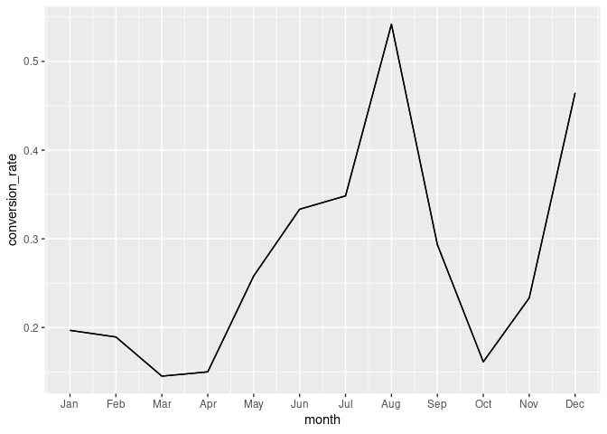
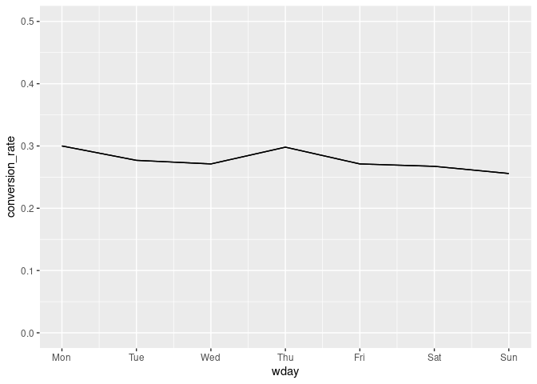
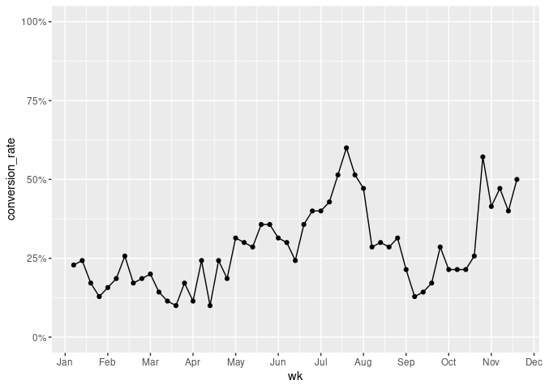
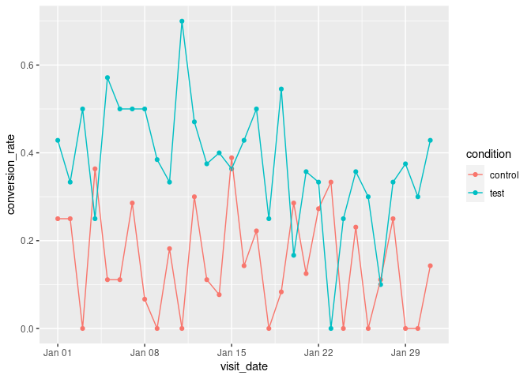

Cats Adoption site
================

## Mini case study in A/B Testing

What’s key to remember is A/B testing is not something you do just once.
You want to be constantly updating your website or app to maximize
things like conversion rates or usage time.

Let’s say you run a cat adoption website. Right now your homepage looks
like this.


You want to know if a different homepage picture would result in more
visitors clicking the “ADOPT TODAY!” button. This is also referred to as
“conversion rate”. In our case, to test this you need two conditions:
one, a control (your current photo),


and two, a test (a new photo). For your test photo, you decide to use
this photo. Your hypothesis is that seeing a cat in a hat will make
people more likely to want to adopt.

***Clickthrough***: did someone click the thing?

***Clickthrough Rate***: site visitors who performed an action/ total
site visitors

# An example of A/B testing:

- Question: will changing the hompage photo result in more ‘ADOPT TODAY’
  clicks?

- Hypothesis: using a photo of a cat wearing a hat will result in more
  ‘ADOPT TODAY’ clicks

- Dependent variable: clicked ‘ADOPT TODAY’ button or not

- Independent variable: homepage photo

``` r
install.packages("tidyverse") 
```

    ## Installing package into '/cloud/lib/x86_64-pc-linux-gnu-library/4.2'
    ## (as 'lib' is unspecified)

``` r
library(tidyverse) 
```

    ## ── Attaching core tidyverse packages ──────────────────────── tidyverse 2.0.0 ──
    ## ✔ dplyr     1.1.0     ✔ readr     2.1.4
    ## ✔ forcats   1.0.0     ✔ stringr   1.5.0
    ## ✔ ggplot2   3.4.1     ✔ tibble    3.2.0
    ## ✔ lubridate 1.9.2     ✔ tidyr     1.3.0
    ## ✔ purrr     1.0.1

    ## ── Conflicts ────────────────────────────────────────── tidyverse_conflicts() ──
    ## ✖ dplyr::filter() masks stats::filter()
    ## ✖ dplyr::lag()    masks stats::lag()
    ## ℹ Use the ]8;;http://conflicted.r-lib.org/conflicted package]8;; to force all conflicts to become errors

``` r
install.packages("lubridate") 
```

    ## Installing package into '/cloud/lib/x86_64-pc-linux-gnu-library/4.2'
    ## (as 'lib' is unspecified)

``` r
library(lubridate) 
install.packages("scales") 
```

    ## Installing package into '/cloud/lib/x86_64-pc-linux-gnu-library/4.2'
    ## (as 'lib' is unspecified)

``` r
library(scales) 
```

    ## 
    ## Attaching package: 'scales'
    ## 
    ## The following object is masked from 'package:purrr':
    ## 
    ##     discard
    ## 
    ## The following object is masked from 'package:readr':
    ## 
    ##     col_factor

``` r
install.packages("powerMediation") 
```

    ## Installing package into '/cloud/lib/x86_64-pc-linux-gnu-library/4.2'
    ## (as 'lib' is unspecified)

``` r
library(powerMediation) 
install.packages("broom") 
```

    ## Installing package into '/cloud/lib/x86_64-pc-linux-gnu-library/4.2'
    ## (as 'lib' is unspecified)

``` r
library(broom) 
```

``` r
click_data <- read_csv("click_data.csv")
```

    ## Rows: 3650 Columns: 2
    ## ── Column specification ────────────────────────────────────────────────────────
    ## Delimiter: ","
    ## dbl  (1): clicked_adopt_today
    ## date (1): visit_date
    ## 
    ## ℹ Use `spec()` to retrieve the full column specification for this data.
    ## ℹ Specify the column types or set `show_col_types = FALSE` to quiet this message.

``` r
experiment_data <- read_csv("experiment_data.csv")
```

    ## Rows: 588 Columns: 3
    ## ── Column specification ────────────────────────────────────────────────────────
    ## Delimiter: ","
    ## chr  (1): condition
    ## dbl  (1): clicked_adopt_today
    ## date (1): visit_date
    ## 
    ## ℹ Use `spec()` to retrieve the full column specification for this data.
    ## ℹ Specify the column types or set `show_col_types = FALSE` to quiet this message.

EDA click_data

``` r
glimpse( click_data )
```

    ## Rows: 3,650
    ## Columns: 2
    ## $ visit_date          <date> 2017-01-01, 2017-01-02, 2017-01-03, 2017-01-04, 2…
    ## $ clicked_adopt_today <dbl> 1, 1, 0, 1, 1, 0, 0, 0, 0, 0, 0, 0, 0, 0, 0, 0, 0,…

``` r
head(click_data)
```

    ## # A tibble: 6 × 2
    ##   visit_date clicked_adopt_today
    ##   <date>                   <dbl>
    ## 1 2017-01-01                   1
    ## 2 2017-01-02                   1
    ## 3 2017-01-03                   0
    ## 4 2017-01-04                   1
    ## 5 2017-01-05                   1
    ## 6 2017-01-06                   0

``` r
min(click_data$visit_date)
```

    ## [1] "2017-01-01"

``` r
max(click_data$visit_date)
```

    ## [1] "2017-12-31"

# Baseline Conversion Rates

What is the current value (e.g. clickrate) before any experimental
variable has been manipulated? Need to know a baseline for comparison,
otherwise, there is no way of knowing if the experimental manipulation
had an effect or not.

find the current conversion rate:

``` r
click_data %>%
  summarize( conversion_rate = mean( clicked_adopt_today ) )
```

    ## # A tibble: 1 × 1
    ##   conversion_rate
    ##             <dbl>
    ## 1           0.277

there is an overall \~27% conversion rate for the year worth of data

now look at the clickthrough rate as a function of month to explore
seasonality effects:

``` r
click_data_sum <- click_data %>%
  group_by(month(visit_date)) %>%
  summarize(conversion_rate = mean(clicked_adopt_today))
```

let’s visualize this result:

``` r
month_abs <- c( 'Jan', 'Feb', 'Mar', 'Apr', 'May', 'Jun', 'Jul', 'Aug', 'Sep', 'Oct', 'Nov', 'Dec')
click_data %>%
  group_by( month = month( visit_date ) ) %>%
  summarise( conversion_rate = mean( clicked_adopt_today ) ) %>%
  ggplot( aes( x = month, y = conversion_rate ) ) +
  geom_path() +
  geom_line() +
  scale_x_continuous( breaks = c(1:12), labels = month_abs )
```

<!-- -->

From this plot, we see that conversion rates are not steady across the
months of the year. Rather, there is a peak during the summer months
culminating in August as well as a peak in December.

How about days of the week?

``` r
wday_lab <- c( 'Mon', 'Tue', 'Wed', 'Thu', 'Fri', 'Sat', 'Sun' )
# Calculate the mean conversion rate by day of the week
click_data %>%
  group_by(wday = wday(visit_date)) %>%
  summarize(conversion_rate = mean(clicked_adopt_today)) %>%
  ggplot( aes( x = wday, y = conversion_rate ) ) +
  geom_path() +
  geom_line() +
  scale_x_continuous( breaks = c(1:7), labels = wday_lab ) +
  ylim( c( 0, 0.5 ) )
```

<!-- -->

don’t observe much difference in conversion rate as a function of day of
the week.

How about by week?

``` r
click_data %>%
  group_by(wk = week(visit_date)) %>%
  summarize(conversion_rate = mean(clicked_adopt_today)) %>%
  ggplot( aes( x = wk, y = conversion_rate ) ) +
  geom_point() +
  geom_line() +
  scale_y_continuous( limits = c( 0,1 ), labels = percent ) +
  scale_x_continuous( breaks = seq( 0,55, by=5 ), labels = month_abs )
```

<!-- -->

# Experimental Design and Power Analysis

How long do we need to run our experiment?

# Power Analysis

-statistical test: what statistical test you’re going to run

-baseline value: value for the current control condition

-desired value: expected value for the test condition

-proportion of the data: from the test condition (ideally 0.5)

-significance threshold/α : level where effect is significant (generally
0.05) -power/1−β : probability correctly rejecting null hypothesis
(generally 0.8)

``` r
total_sample_size <- SSizeLogisticBin(p1 = 0.2,
                                      p2 = 0.3,
                                      B = 0.5,
                                      alpha = 0.05,
                                      power = 0.8)
total_sample_size
```

    ## [1] 587

``` r
total_sample_size/2
```

    ## [1] 293.5

``` r
# Compute and look at sample size for experiment in August
total_sample_size <- SSizeLogisticBin(p1 = 0.54, #get the value for August
                                      p2 = 0.64,
                                      B = 0.5,
                                      alpha = 0.05,
                                      power = 0.8)
res <- paste( 'Total Sample Size:', total_sample_size, 
              '\nSize for each condition:', total_sample_size/2 )
cat( res, sep = '\n' )
```

    ## Total Sample Size: 758 
    ## Size for each condition: 379

Compare the above result with a predicted increase in clickthrough of
10% with that of the 5%

``` r
# Compute and look at sample size for experiment in August with a 5 percentage point increase
total_sample_size <- SSizeLogisticBin(p1 = 0.54,
                                      p2 = 0.59,
                                      B = 0.5,
                                      alpha = 0.05,
                                      power = 0.8)
res <- paste( 'Total Sample Size:', total_sample_size, 
              '\nSize for each condition:', total_sample_size/2 )
cat( res, sep = '\n' )
```

    ## Total Sample Size: 3085 
    ## Size for each condition: 1542.5

## Mini case study in A/B Testing 2

# Analyzing Results

loading the experimental data:

``` r
glimpse( experiment_data)
```

    ## Rows: 588
    ## Columns: 3
    ## $ visit_date          <date> 2018-01-01, 2018-01-01, 2018-01-01, 2018-01-01, 2…
    ## $ condition           <chr> "control", "control", "control", "control", "test"…
    ## $ clicked_adopt_today <dbl> 0, 1, 0, 0, 0, 0, 1, 0, 0, 1, 1, 0, 1, 1, 0, 0, 1,…

look at conversion rate as a function of visit date:

``` r
experiment_data_sum <- experiment_data %>%
  group_by(visit_date, condition) %>%
  summarize(conversion_rate = mean(clicked_adopt_today))
```

    ## `summarise()` has grouped output by 'visit_date'. You can override using the
    ## `.groups` argument.

Now visualize:

``` r
ggplot(experiment_data_sum, aes(x = visit_date, y= conversion_rate, 
                                color = condition,
                                group = condition)) + 
  geom_point() +
  geom_line()
```

<!-- -->

Generally, the test condition is higher than the control group on any
given day. Next to support this observation with statistics.

``` r
#logistic regression
glm( clicked_adopt_today ~ condition,
     family = 'binomial',
     data = experiment_data ) %>%
  tidy()
```

    ## # A tibble: 2 × 5
    ##   term          estimate std.error statistic  p.value
    ##   <chr>            <dbl>     <dbl>     <dbl>    <dbl>
    ## 1 (Intercept)      -1.61     0.156    -10.3  8.28e-25
    ## 2 conditiontest     1.14     0.197      5.77 7.73e- 9

The p-value for condition is very small (much smaller that conventional
cutoffs: 0.05, 0.01), so we can reject the null hypothesis that there is
no difference between groups. Additionally, the estimate for the test
condition is \~1.14, therefore the test condition’s mean is \~1.14
greater than the control condition.

# Designing Follow-up Experiments

*Tips for desiging new experiments:*

- Build several small follow-up experiments. But make sure they are
  unique testable ideas that introduce 1 measurable change.

- avoid confounding variables

- test small changes

- Here’s an idea for the next experiment:

For the previous example the test condition’s conversion rate was 39%.
Let’s find the sample size we would need for the next test condition
where we estimate that the conversion rate will increase to 59%:

``` r
# Run logistic regression power analysis
total_sample_size <- SSizeLogisticBin(p1 = 0.39,
                                      p2 = 0.59,
                                      B = 0.5,
                                      alpha = 0.05,
                                      power = 0.8)
total_sample_size
```

    ## [1] 194

Good luck with your future experiments!

*ps. This case study is a part of datacamp course A/B testing with R*
